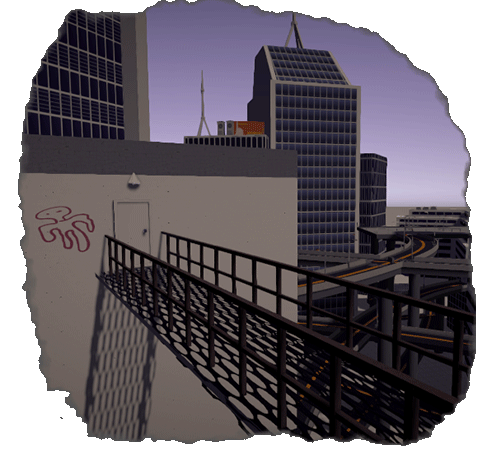
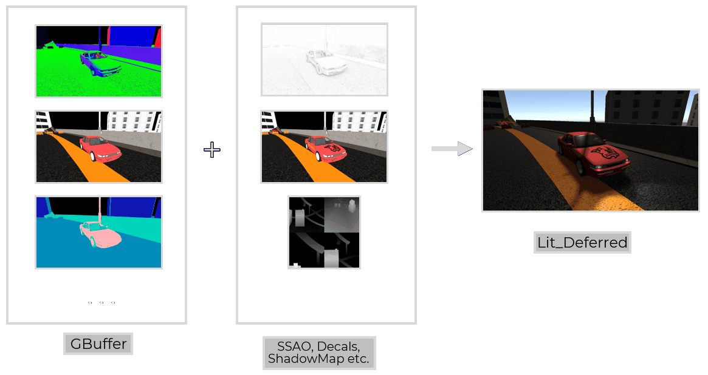
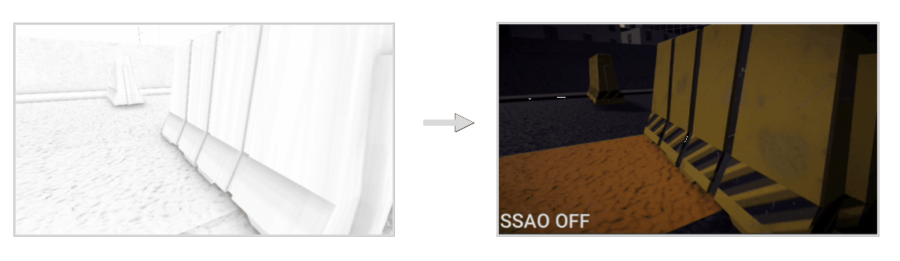
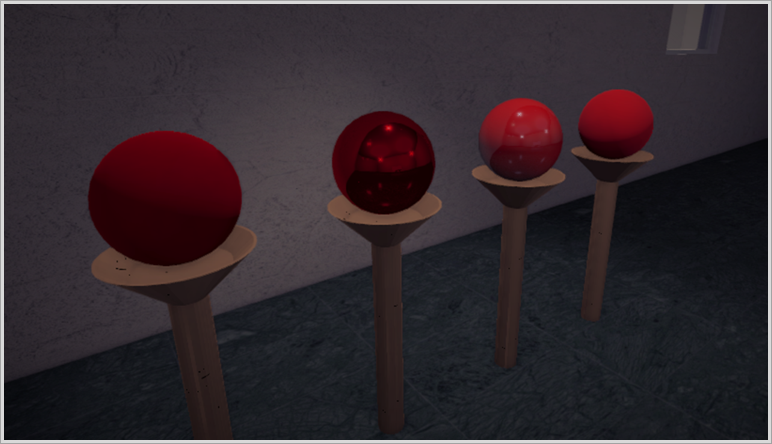
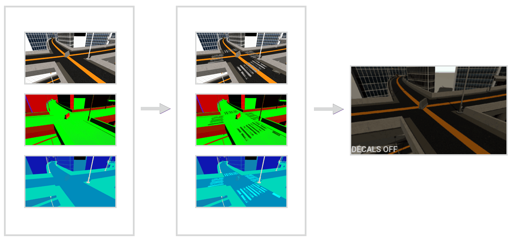
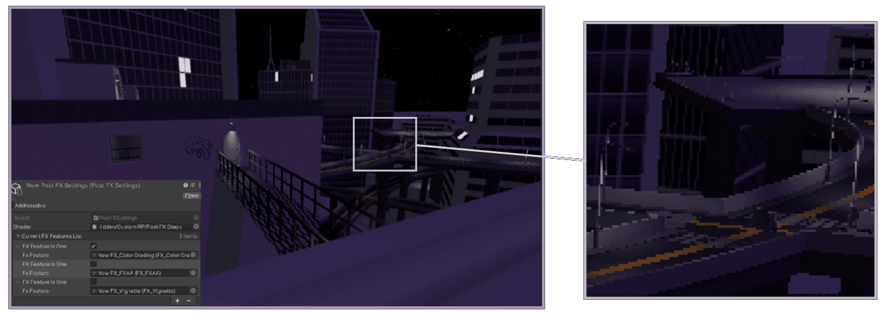

<h1 align="center">
Car – A Harsh Story (iter 1)
</h1>

<h5 align="center">
First iteration oh my custom SRP in Unity with testing scene included
</h5>

    

-------------------

## About this repository
This repository is a project I made while doing a task from a graphical programing contest held by CarX Tech. in 2023, november.
[The original repository](https://github.com/CarXTechnologies/SRP_example).
I didn't know a think about computer graphics, so the initial architecture was based on legendary
[Jasper Flick](https://catlikecoding.com/unity/tutorials/custom-srp/) tutorials. I heavily modified the code, changed the whole render to deferred one etc., but my love is set in stone. 
  Also, [Freya Holmer](https://youtu.be/kfM-yu0iQBk?si=Qs6ERZFSszIAS0VP) is a great teacher

The repo includes:
- Custom SRP made from scratch (DopeRP)
- Destruction system for both car and world objects (made using Morpeh ECS framework) (SOFT-BODY DAMAGE WAS NOT IMPLEMENTED NEITHER WITH PHYSICAL MEANS NOR WITH BONES)
- Two control modes (heavily relied on Cinemachine, uses Input System unity package)
- A scene I build to demonstrate all the stuff above (buildings are from asset store, car was shipped with the original repo, all the other stuff was made by me and my friend using Blender and Houdini)
-------------------

# Stuff I Implemented
## Graphics (SRP + shaders)
### Deferred Rendering
Implemented G_Buffer from scratch by myself. The final image is assembled in lit_deferred shader (using fullscreen quad):

    

### SSAO

A classical algorithm from [LearnOpenGL](https://learnopengl.com/Advanced-Lighting/SSAO)
modified a bit with info from [3d-game-shaders-for-beginners](https://lettier.github.io/3d-game-shaders-for-beginners/ssao.html):

    

### PBR Materials
Standard model from [Filament open-source game engine](https://google.github.io/filament/Filament.md.html)

    

### Screen Space Decals

A base idea from [Drawing Stuff On Other Stuff With Deferred Screenspace Decals](https://martindevans.me/game-development/2015/02/27/Drawing-Stuff-On-Other-Stuff-With-Deferred-Screenspace-Decals/)
that was heavily modified on the go (like, I added my way of calculating normals from textures, physical params for pbr, alpha-clipping etc.)

    

Also, I used decals as part of my damage system:

<table align="center">
  <tr>
    <td colspan="2" align="center" style='border:3px solid #d9d9d9; padding: 0'>
      
    </td>
  </tr>
</table>

### PostFX
PostFX was taken from [catlikecoding tutorials](https://catlikecoding.com/unity/tutorials/custom-srp/post-processing/). I improved the system so I now can easily add new features to the stuck, like, on the go
just via SO.
 
Speaking of implemented features, the repo has three of them:
1. Color Grading – the variant from catlikecoding, not modified, just added
2. FXAA – [glsl-fxaa, mattdesl](https://github.com/mattdesl/glsl-fxaa)
3. Vignette – from Acelola Shorts :)

    

### Stencil Buffer
I wanted to have especially something interesting in this project so I played a bit with stencil buffer:

    <table>
      <tr>
        <td colspan="2" align="center">
          
        </td>
      </tr>
      <tr>
        <td align="center">
          
        </td>
        <td align="center" >
          
        </td>
      </tr>
    </table>

## Gameplay/Client code
Made code for little demo purposes – a combination of classical unity OOP and Morpeh framework ECS
Including:
- Two control modes: car driving and camera (that can shoot balls)
- Change of daytime on single key
- Destruction system (for both can and some world objects)

<table align="center">
  <tr>
    <td colspan="1" align="center" style='border:3px solid #d9d9d9; padding: 0'>
      

          
        

    </td>
  </tr>
</table>

-------------------
## Used Stuff
### From Unity asset store:
- [White City, ALIyerEdon](https://assetstore.unity.com/packages/3d/environments/urban/white-city-76766)
- [PROMETEO: Car Controller, Mena](https://assetstore.unity.com/packages/p/prometeo-car-controller-209444)

### Code:
- [Morpeh ECS Framework](https://github.com/scellecs/morpeh)

### Unity Registry:
- Input System
- Cinemachine
- ProBuilder

### Unique assets:
- Lots of ambient 3D model stuff was made in Blender by a friend of mine, Alexey Melnikov. All the files located under "../Assets/Models/Benefactor/"
- And, of course, the car model is not mine. It was included in the original repo
- All the other stuff was made by me both in Blender and Houdini
-------------------
